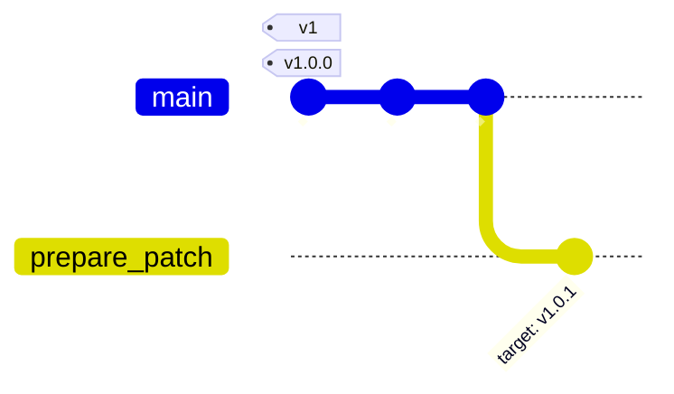
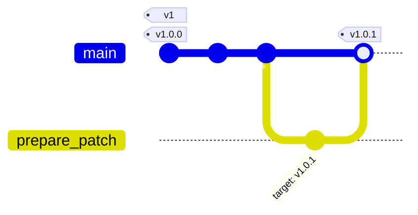

# Automations for GitHub Releases

[](https://github.com/uclahs-cds/tool-create-release/actions/workflows/internal-prepare.yaml)

* [Versioning Standards](#versioning-standards)
* [Usage](#usage)
  * [README Badges](#readme-badges)
* [Parameters](#parameters)
  + [Updating hard-coded strings with `version_files`](#updating-hard-coded-strings-with-version_files)

This set of reusable workflows manages the complexity of creating and tagging new software releases on GitHub.

## Versioning Standards

These workflows make the following assumptions:

* Versions begin with a digit. This applies whether the project is using [semantic versioning](https://semver.org/) or not.
* Git tags associated with a version begin with a `v`.

`1.2.3`, `1.alpha`, and `4.2` are all acceptable versions, and will be tagged in git as `v1.2.3`, `v1.alpha`, and `v4.2` respectively.

`alpha`, `one.two`, and `v1.2.3` are **not** acceptable versions.

## Usage

Usage of this tool requires adding three workflows to each calling repository (non-semantic repositories only need two). Complete versions of these workflows can be copied from the [templates/](templates/) directory.

`wf-prepare-release.yaml` is triggered manually (via a `workflow_dispatch`) and takes the following actions:

1. Compute the target version number.
  * Semantic repositories compute the version based on existing tags and user input for the bump type (`major`/`minor`/`patch`) and the prerelease flag.
  * Non-semantic repositories accept the next version as an input.
1. Re-write the `CHANGELOG.md` file to move unreleased changes into a new dated release section.
1. (Optional) Update hardcoded version strings in files passed to `version_files` input.
1. Open a PR listing the target version number and release tag.



`wf-finalize-release.yaml`, triggered when a release PR is merged, takes the following actions:

1. Create a new release with auto-generated notes and the target tag.
  * By default the new release is a draft, so no public release or tag are created without user intervention.
1. Comment on the release PR with a link to the new release.



> [!NOTE]
> `wf-alias-release.yaml` is only applicable for repositories using semantic versioning.

`wf-alias-release.yaml`, triggered when a release is published or deleted, synchronizes the corresponding [major tag alias](https://docs.github.com/en/actions/sharing-automations/creating-actions/about-custom-actions#using-tags-for-release-management) to the highest non-prerelease release tag:


### README Badges

You can add a badge that links to the release preparation workflow by including one of these Markdown snippets (after replacing `ORG` and `REPO`) to your README:

#### Public Repository
[](https://github.com/uclahs-cds/tool-create-release/actions/workflows/internal-prepare.yaml)
```
[](https://github.com/ORG/REPO/actions/workflows/prepare-release.yaml)
```

#### Private / Internal Repository
[](https://github.com/uclahs-cds/tool-create-release/actions/workflows/internal-prepare.yaml)
```
[](https://github.com/ORG/REPO/actions/workflows/prepare-release.yaml)
```

## Parameters

Parameters can be specified using the [`with`](https://docs.github.com/en/actions/creating-actions/metadata-syntax-for-github-actions#runsstepswith) option.

| Workflow | Parameter | Type | Required | Description |
| ---- | ---- | ---- | ---- | ---- |
| `wf-prepare-release.yaml` | `bump_type` | string | yes | Kind of semantic release version to target. Must be one of `major`, `minor`, `patch`, or `exact`. Using `exact` requires `exact_version`. |
| `wf-prepare-release.yaml` | `prerelease` | boolean | no | If true, mark the bumped semantic release as a prerelease (only used if `bump_type` is not `exact`). |
| `wf-prepare-release.yaml` | `version_files` | string | no | Comma-separated relative paths to files containing hardcoded version strings (see note below). |
| `wf-prepare-release.yaml` | `exact_version` | string | no | The exact version to assign to the next release (only used if `bump_type` is `exact`). Must not include a leading `v` - use `1XXXX`, not `v1XXXX`. |
| `wf-prepare-release.yaml` | `changelog` | string | no | Relative path to the CHANGELOG file. Defaults to `./CHANGELOG.md`. |
| `wf-prepare-release.yaml` | `timezone` | string | no | IANA timezone to use when calculating the current date for the CHANGELOG. Defaults to `America/Los_Angeles`. |
| `wf-finalize-release.yaml` | `draft` | boolean | no | If true (the default), mark the new release as a draft and require manual intervention to continue. |


### Updating hard-coded strings with `version_files`

> [!TIP]
> If possible, avoid embedding version numbers in version-controlled files. An alternative is to dynamically generate version numbers during the build or release process - [hatch-vcs](https://github.com/ofek/hatch-vcs) or [setuptools-scm](https://pypi.org/project/setuptools-scm/) can do this for python packages.

Hard-coded version strings in files (e.g. in `nextflow.config` or `_version.py` files) can be updated by passing the filepath to the `version_files` input. The update behavior is simple and brittle: every input file must have exactly one line that looks like `version = '1.2.3'` (see the full regex in [`updatefiles.py`](./bumpchanges/updatefiles.py)). Multiple matches or no matches will stop the release.

## License

tool-generate-docs is licensed under the GNU General Public License version 2. See the file LICENSE.md for the terms of the GNU GPL license.

Copyright (C) 2024 University of California Los Angeles ("Boutros Lab") All rights reserved.

This program is free software; you can redistribute it and/or modify it under the terms of the GNU General Public License as published by the Free Software Foundation; either version 2 of the License, or (at your option) any later version.

This program is distributed in the hope that it will be useful, but WITHOUT ANY WARRANTY; without even the implied warranty of MERCHANTABILITY or FITNESS FOR A PARTICULAR PURPOSE. See the GNU General Public License for more details.
